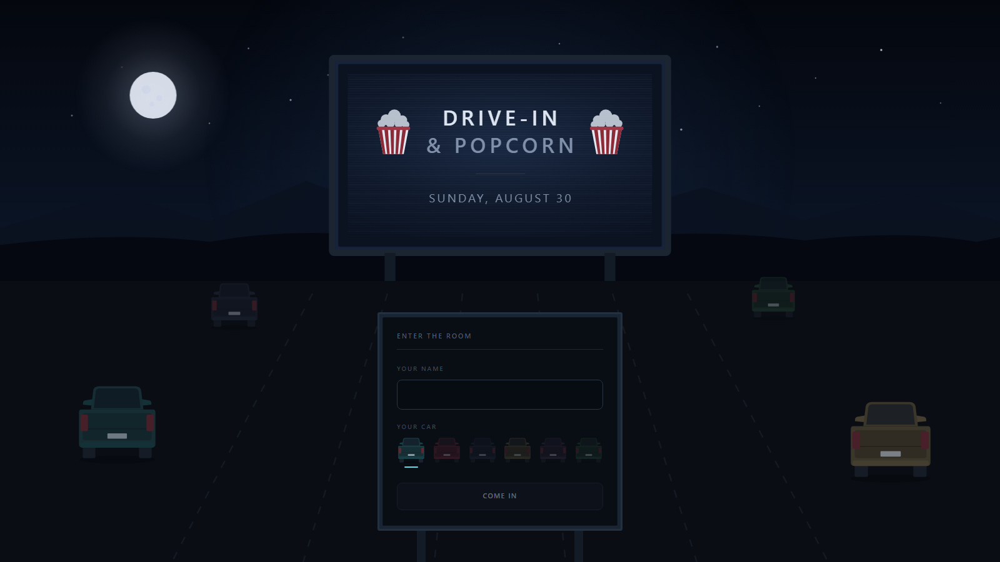
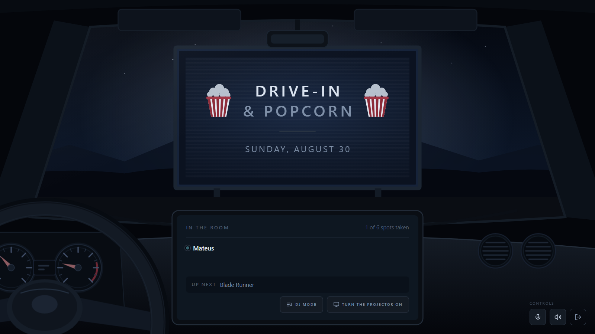
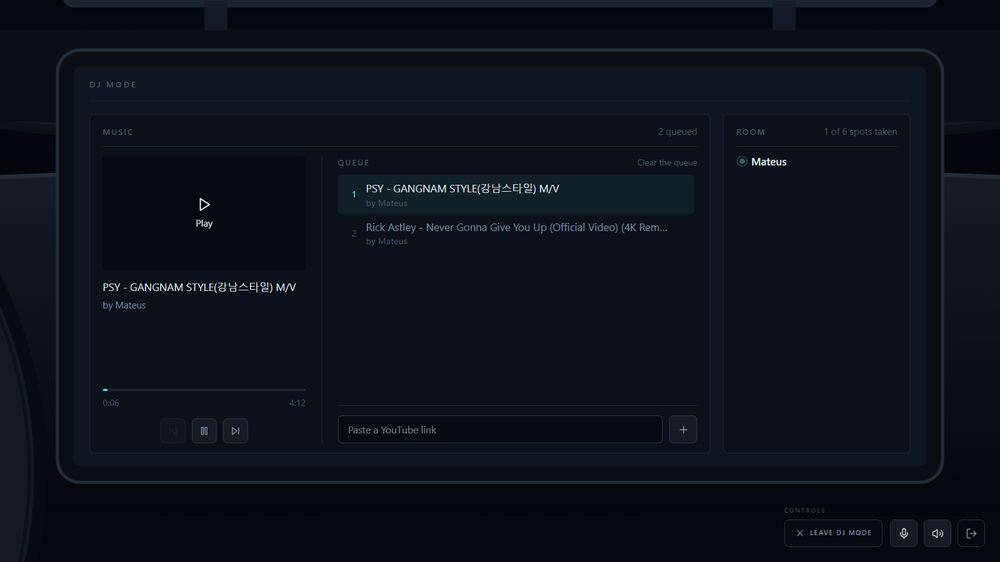

# Drive-In & Popcorn

A private drive-in for a closed group of friends. One person shares their screen,
everyone watches together and talks over voice. It runs in the browser — nobody
installs anything to attend.

There are no accounts, no sign-up and no passwords. A room is created from the
command line and prints a link; the link is the whole invitation. Whoever has it
types a name and walks in.



*Opening the link. You type a name, pick a car, and that is the whole sign-up.*



*Inside. The interface is the car's dashboard — who is here, what is playing, and
the two things the room can do.*



*DJ mode, with the camera closed in on the dashboard. The queue has no owner and
every browser plays the same second of the same video.*

## How it works

1. A script creates the room and prints a link.
2. Whoever gets the link types a name and enters.
3. One person at a time takes the stage and shares their screen; the rest watch.
4. Each participant's voice has its own volume, separate from the movie audio.
5. With no movie playing, the room becomes DJ mode: a queue of YouTube links that
   everyone feeds, playing in sync.
6. The room closes itself five minutes after the last person leaves.

## Requirements

| | |
|---|---|
| Node | 24 or newer |
| pnpm | 11 or newer |
| Docker | with Compose v2 |

Nothing else. There is no database to provision, no mail provider and no
third-party API key — the only two secrets are ones you generate yourself, below.

## Install

### 1. Clone and install

```bash
git clone https://github.com/mateusbpt/drive-in.git && cd drive-in && pnpm install
```

### 2. Create your `.env`

```bash
cp .env.example .env
```

### 3. Generate the LiveKit key pair

LiveKit is the media server. It ships a generator, so you never invent these by
hand:

```bash
docker run --rm livekit/livekit-server generate-keys
```

Copy the two values into `LIVEKIT_API_KEY` and `LIVEKIT_API_SECRET`.

### 4. Generate the session secret

This one signs the participant token the API hands out at the door:

```bash
openssl rand -base64 32
```

Copy it into `SESSION_SECRET`.

### 5. Start Redis and LiveKit

```bash
pnpm infra:up
```

Rooms live in Redis with an expiry date, so there is nothing to migrate or seed.

### 6. Run the two dev servers

In one terminal:

```bash
pnpm dev:api
```

In another:

```bash
pnpm dev
```

The API listens on `:3000` and the frontend on `:5173`, which proxies `/api` to
the API — same origin, no CORS to configure.

### 7. Create a room

```bash
pnpm room:create
```

It prints a link. Open it, type a name, and you are in. Open the same link in a
second browser to see the other side.

## Room commands

Administration is command line, never an HTTP route. There is no endpoint that
creates a room, so a leaked link can never become a room factory.

```bash
pnpm room:create          # creates a room and prints the link
pnpm room:list            # lists open rooms
pnpm room:lock <token>    # stops accepting new people
pnpm room:close <token>   # ends the room now
pnpm room:check           # checks that Redis and LiveKit answer
```

## Interface language

English by default. For Brazilian Portuguese, set this before building or running
the frontend:

```bash
VITE_LANG=pt-BR
```

Both translations sit side by side in `apps/web/src/strings.ts`. Adding a third
means adding one more object to that file — no UI string is written inline in a
component.

## Configuration

Everything lives in `.env`. The four that matter in development:

| | |
|---|---|
| `LIVEKIT_API_KEY` / `LIVEKIT_API_SECRET` | generated in step 3 |
| `SESSION_SECRET` | generated in step 4 |
| `LIVEKIT_URL` | `ws://127.0.0.1:7880` locally |
| `PUBLIC_BASE_URL` | `http://localhost:5173` locally — this is what room links point at |

And two that shape how rooms behave:

| | |
|---|---|
| `ROOM_TTL_HOURS` | how long a room survives after being created |
| `ROOM_EMPTY_MIN` | minutes with nobody inside before the room closes itself |

## Running it for real

The production build puts both halves behind one domain: the frontend is built
into the API image and served by it, so the browser talks to a single origin.

```bash
pnpm build
```

Point `WEB_ROOT` at the built frontend, set `PUBLIC_BASE_URL` and `LIVEKIT_URL`
to your real hostnames, and put a TLS-terminating proxy in front. Then open the
ports LiveKit needs:

| Port | |
|---|---|
| 443 TCP | the app, and the LiveKit signalling WebSocket |
| 7881 TCP | media fallback |
| 7882 UDP | media |

If UDP is blocked, media falls back to TURN over TCP. It still connects — it just
stutters. So when the picture degrades and the connection is otherwise healthy,
check UDP before looking anywhere else.

`infra/README.md` carries the deployment notes.

## Layout

| Directory | |
|---|---|
| [`apps/api`](apps/api/README.md) | rooms, tokens, stage control, WebSocket and CLI |
| [`apps/web`](apps/web/README.md) | the room itself |
| `packages/shared` | contracts exchanged between the two |
| `infra` | Compose files for the dependencies, and deployment notes |

## Stack

| | |
|---|---|
| Interface | React, Vite and Tailwind |
| Server | Node and Hono |
| State | Redis, rooms with a TTL |
| Media | LiveKit (SFU) |
| Screen capture | `getDisplayMedia`, in the browser |

## Decisions

**A room is born from a script, never from an HTTP route.** There is no endpoint
that creates rooms: it would be the most attackable surface in the system, for
something used once a week.

**The link is the entire credential.** The token travels in the URL fragment,
which the browser never sends to the server — it stays out of access logs and out
of the `Referer` header.

**There is no database.** Each room is a Redis key with an expiry. With no
accounts and no history, nothing needs to outlive the session.

**The music never passes through our media server.** In DJ mode the server says
which track is playing and since when; each browser loads the same video and puts
itself at the same second. Relaying someone else's audio through our SFU would
cost bandwidth and go against the terms of whoever serves the video.

**The stage is the server's decision.** The LiveKit token is minted with
microphone permission only; screen permission is granted on the SFU itself, so a
client cannot publish on its own initiative.

## License

MIT. See [LICENSE](LICENSE).
